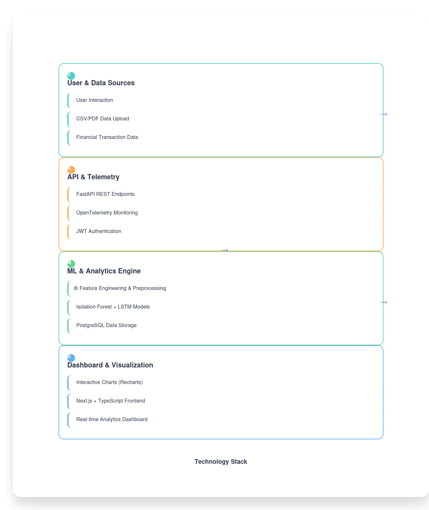

# Architecture Decision Record (ADR)

## Platform Architecture Overview

This ADR documents the core architecture of the financial transaction monitoring platform, including the data flow from telemetry to ML to the UI.

---

## Visual Architecture Diagram

*For the source diagram, see `architecture.mmd`. To update the image, edit the `.mmd` file and re-render using Mermaid CLI.*

---

## Data Flow Description

1. **User Interaction / Data Upload**: Users upload transaction data (CSV, PDF) via the web UI.
2. **API & Telemetry**: FastAPI endpoints receive the data, and telemetry is collected via OpenTelemetry for observability and monitoring.
3. **ML & Analytics**: Data is preprocessed and features are engineered. Anomaly and fraud detection is performed using Isolation Forest and business rules. Results are stored in PostgreSQL.
4. **Dashboard UI**: The frontend (Next.js) fetches analytics and results via REST API, providing interactive dashboards and visualizations. Telemetry data may also be surfaced for operational monitoring.

---

## Rationale
- **Separation of concerns**: Each layer (telemetry, ML, UI) is modular and independently scalable.
- **Observability**: Telemetry is integrated at the API layer for real-time monitoring and auditing.
- **Extensibility**: ML logic and UI can be extended independently for new analytics or visualizations.

---

*This ADR should be updated as the architecture evolves. For rendered diagrams, use the Mermaid Live Editor or compatible Markdown viewers.*
